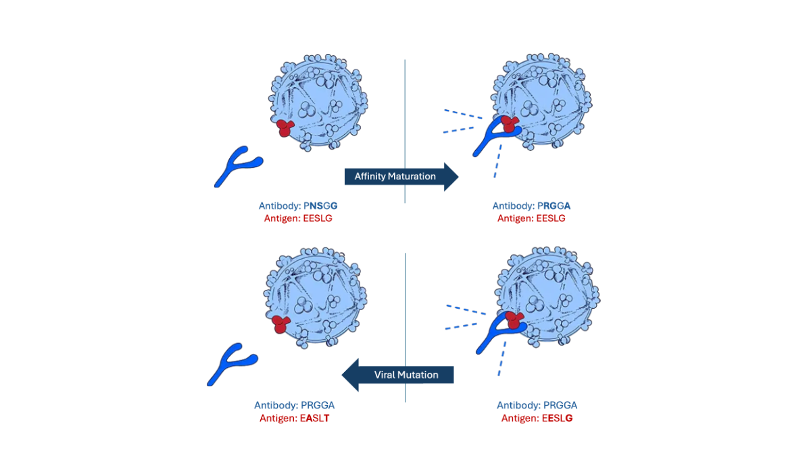

# Antibody-Virus Co-evolution Simulation with MARL
This project investigates the potential of Multi-Agent Reinforcement Learning (MARL) approaches to simulate antibody-virus co-evolution.
<p align="center">
  
</p>

### About
Simulating antibody-virus co-evolution is crucial for understanding immune response and developing effective vaccines. This study explores two MARL algorithms: [Q-learning](https://doi.org/10.1016/B978-1-55860-335-6.50027-1) and [Minimax Deep Deterministic Policy Gradient (M3DDPG)](https://people.eecs.berkeley.edu/~russell/papers/aaai19-marl.pdf). The agents represent an antibody and an antigen interacting within a simulated environment. The antibody strives to bind to the antigen, while the antigen attempts to mutate its structure to evade binding.

### Methods
The project implements two MARL algorithms:
* Q-learning: The antibody agent employs Q-learning to learn a policy for binding to the antigen.
* M3DDPG: This actor-critic based approach inspired by minimax is used for the antigen agent. It allows the antigen to learn a policy for mutating its structure to evade the antibody. This implementation is based on the [PyTorch version](https://github.com/yoshinobc/M3DDPG-pytorch) of M3DDPG.

The simulation environment models the interaction between the antibody and antigen. The agents receive rewards based on their actions (binding or mutation) and the resulting outcome.

### Dependencies
* Python 3.x
* [PettingZoo](https://github.com/Farama-Foundation/PettingZoo)
* [PyTorch](https://pytorch.org/get-started/locally/)
* (Optional) [Gymnasium](https://github.com/openai/gym?tab=readme-ov-file)

### Implementation
* Q-learning: ```python -m q-learning```
* M3DDPG: ```python -m main```
